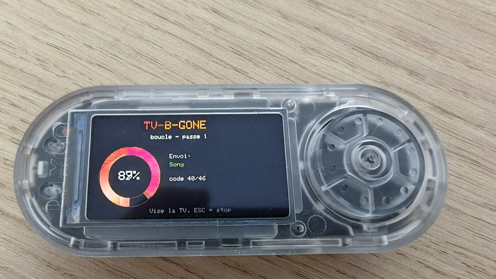
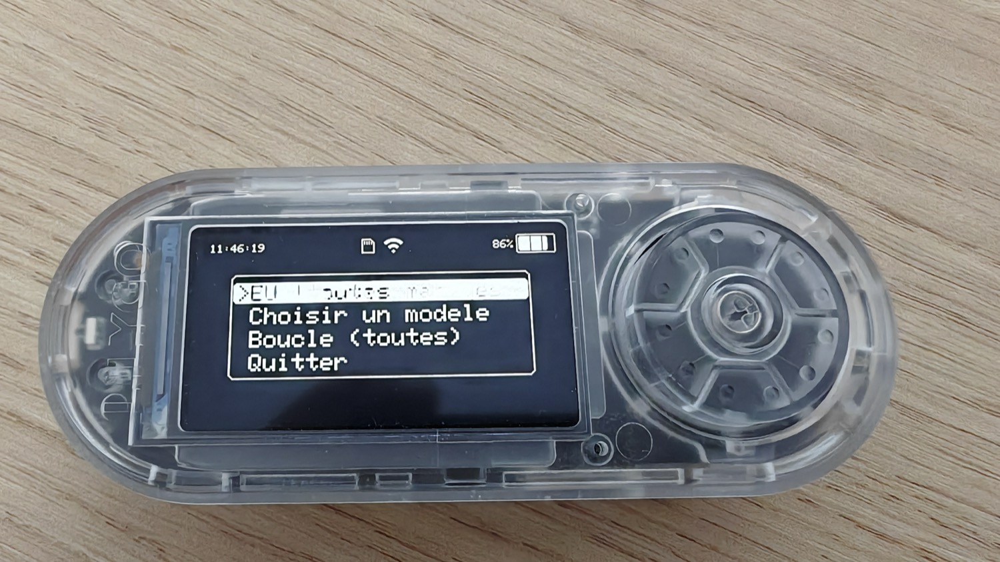
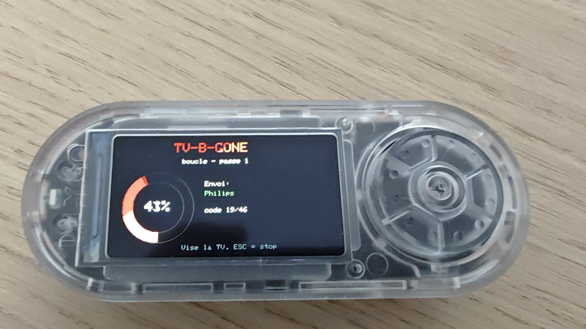
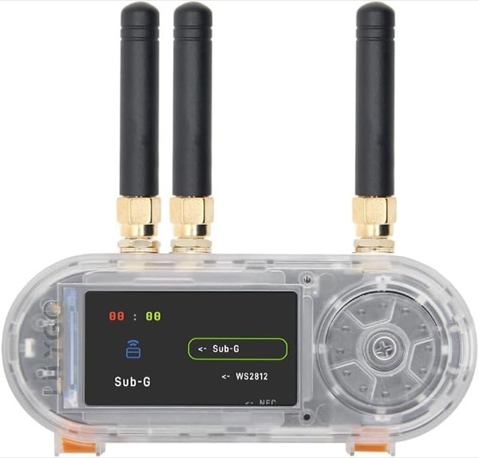
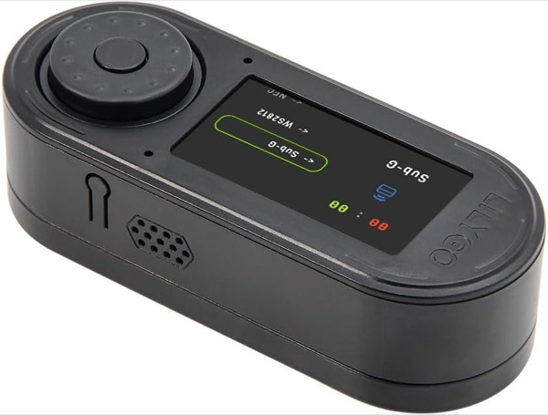
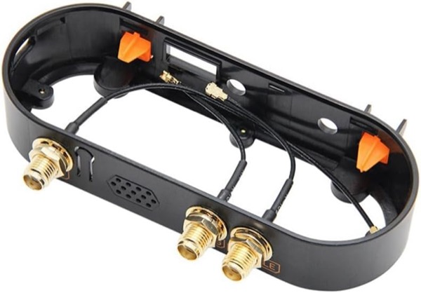

# 📺🔴 TV-B-Gone — pour Bruce

  

> **EN** — A TV-B-Gone written in JavaScript for the **[Bruce firmware](https://github.com/BruceDevices/firmware)** (LilyGO T-Embed CC1101). It blasts a database of infrared **POWER** codes from many TV brands to switch off (almost) any TV. Sends codes one by one with a **progress ring + % + current brand**, and can target **all brands** or **one specific model**.

Un **TV-B-Gone** en JavaScript pour le firmware **[Bruce](https://github.com/BruceDevices/firmware)** (testé sur **LilyGO T-Embed CC1101**). Il envoie une base de codes infrarouge **POWER** multi-marques pour **éteindre (presque) n'importe quelle TV**. Les codes partent **un par un** avec un **anneau de progression + % + marque en cours**, en visant **toutes les marques** ou **un modèle précis**.

## ✨ Fonctionnalités

- **~300 codes POWER** = la **base TV-B-Gone complète** (`WORLD_IR_CODES` NA + EU, convertie en `.ir`) **+** des codes de marque (Samsung, LG, Sony, Panasonic, Philips, Sharp, Toshiba, TCL, RCA…). **Même couverture que le TV-B-Gone natif de Bruce.**
- **Anneau de progression** qui se remplit + **%** + **marque/région en cours** (envoi code par code).
- **Modes** : **toutes** · **région NA** ou **EU** · **une marque précise** (menu). Option **Boucle** jusqu'à ESC.
- **ESC** réactif (testé entre chaque code).

> ⚙️ **Si rien ne s'éteint** : vérifie dans **Config → IR** que le **pin TX = « Default »** (la LED IR du T-Embed CC1101 est sur ce pin, pas 43/44), et éventuellement monte les **répétitions IR**. Le script utilise le même pin/réglages que le TV-B-Gone natif. L'IR est **directionnel** : vise bien la TV, d'assez près.

| Menu | Progression |
|------|-------------|
|  |  |

## 🚀 Installation

1. Copie **`TV-B-Gone.js`** **ET** **`tvbgone.ir`** sur la SD, dans un dossier lu par Bruce : **`/scripts`**, `/BruceJS` ou `/BruceScripts` (les deux fichiers ensemble).
2. Sur l'appareil : **JS Interpreter** → lance `TV-B-Gone.js`.
3. Choisis le mode, **vise la TV** avec l'émetteur IR, laisse tourner. **ESC** pour stopper.

Le script cherche `tvbgone.ir` automatiquement dans `/scripts`, `/BruceScripts`, `/BruceJS` et à la racine.

## 🔧 Étendre la base

`tvbgone.ir` est un fichier IR au format Flipper (`name: … / protocol / address / command`). Tu peux y ajouter d'autres codes POWER (extraits de la base IR de Bruce ou d'ailleurs) : ajoute un bloc `name: Marque Pwr` et il apparaîtra dans le menu « Choisir un modèle ».

## 📝 Notes

- L'**infrarouge est directionnel et à sens unique** : vise la TV, et l'appareil **ne sait pas** si elle a réagi — **regarde l'écran de la TV**.
- **Bruce a aussi un TV-B-Gone natif** (menu IR) — ceci est la version **script** (UI de progression, ciblage par marque, extensible, publiable).
- Codes extraits de la **base IR embarquée de Bruce**.
- 🤝 Pour rire / usage responsable (ta TV, un pote consentant…).

## 🛒 Matériel / Hardware

Le matériel utilisé pour ce projet — liens affiliés Amazon :

|  |  |  |
|:---:|:---:|:---:|
| 🔌 **[LilyGO T-Embed CC1101](https://link.amazon/B0cgD7wou)** avec antennes | ⬛ **[LilyGO T-Embed CC1101](https://link.amazon/B071fmsbH)** noir, sans antenne | 📡 **[Kit d'antennes SMA](https://link.amazon/B0eMlSqeZ)** |

En tant que Partenaire Amazon, je réalise un bénéfice sur les achats remplissant les conditions requises. · As an Amazon Associate I earn from qualifying purchases.

## ☕ Un café ?

## 📄 Licence

MIT — voir [LICENSE](LICENSE). Par **koua29** (Arnaud).
